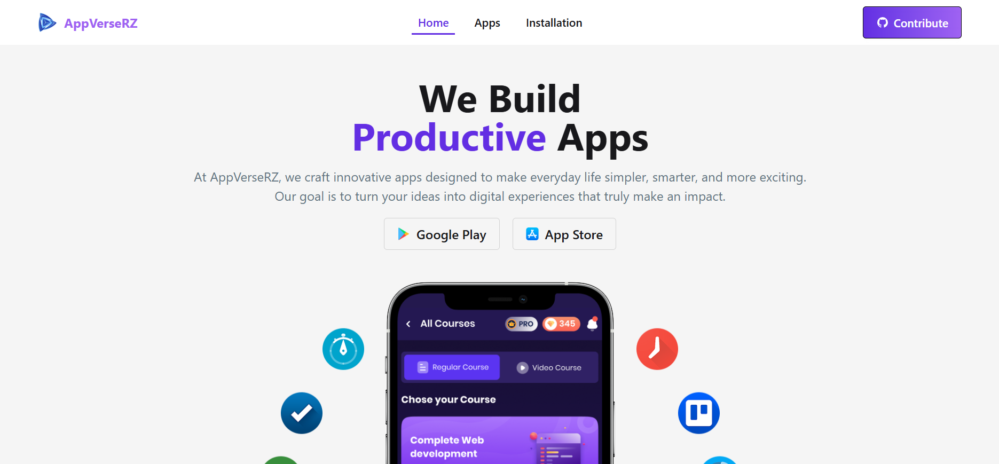

# AppVerseRZ



## Description

AppVerseRZ is a modern web platform for exploring and downloading applications. Users can search for apps, view app details, and navigate through the marketplace seamlessly. The platform provides a clean, responsive interface and ensures a smooth user experience with live search and proper error handling.

---

## Live URL
https://appverserz.netlify.app/

---

## Key Features

* Live app search with instant results
* Detailed app information pages
* Smooth navigation using React Router
* Fully responsive UI (mobile, tablet, desktop)
* Modern UI built with Tailwind CSS + DaisyUI
* Error handling for invalid searches or missing data
* Clean component-based architecture

---

## NPM Packages Used / Dependencies

### **Main Dependencies**

* **react** – Core library for UI
* **react-dom** – DOM renderer for React
* **react-router-dom** – Client-side routing
* **tailwindcss** – Utility-first styling
* **daisyui** – Tailwind UI components
* **axios or fetch** – API calling (if used)

### **Dev Dependencies**

* **vite** – Development server and build tool
* **postcss** – Tailwind CSS processor
* **autoprefixer** – Automatically adds vendor prefixes

---

## How to Run on a Local Machine

### **1. Clone the Repository**

```bash
git clone https://github.com/Razaan-RR/AppVerseRZ.git
```

### **2. Navigate to the Project Folder**

```bash
cd AppVerseRZ
```

### **3. Install Dependencies**

```bash
npm install
```

### **4. Start the Development Server**

```bash
npm run dev
```

### **5. Open in Browser**

Visit the URL shown in the terminal, usually:

```
http://localhost:5173
```

Your project is now running locally! 🚀
